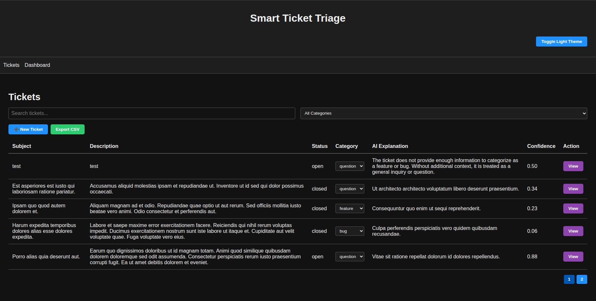
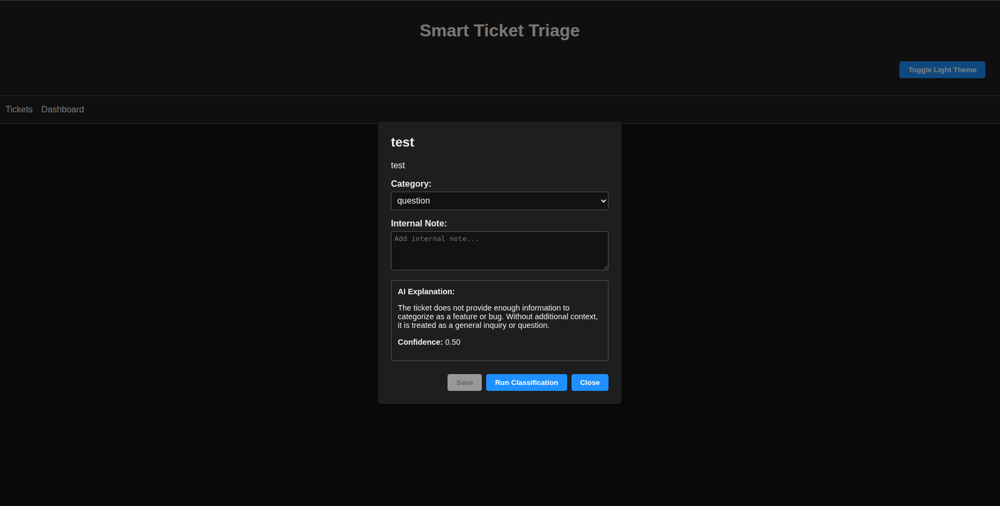
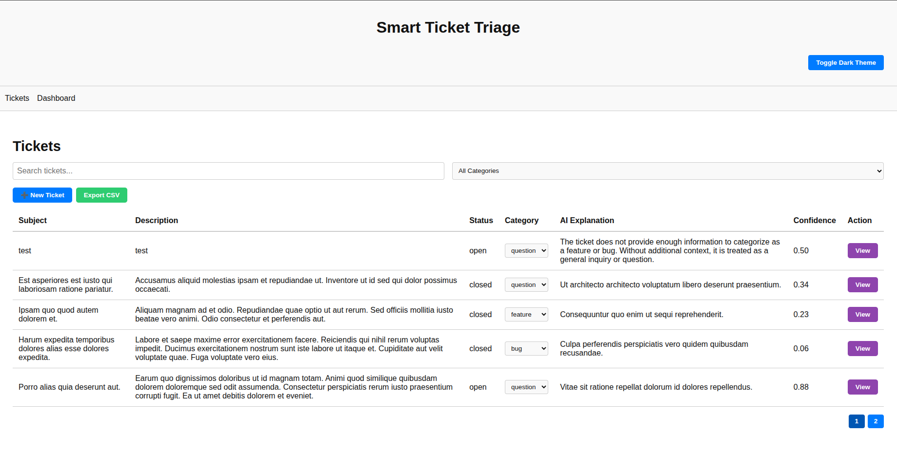
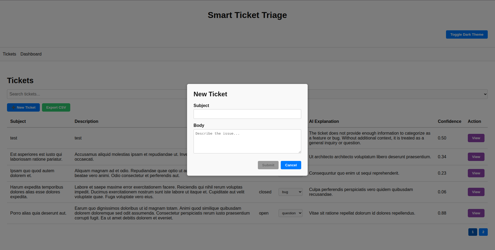

## 📦 Project Versions

- **Laravel:** 11.x
- **Vue.js:** 3.x
- **Node.js:** >= 20.x
- **PHP:** >= 8.2
- **Composer:** 2.x
- **NPM:** 8.x or later

Make sure your local environment matches these versions for best compatibility.

# 🧠 Smart Ticket Triage API

A simple API to manage and classify support tickets using Laravel and OpenAI.

---

## ⚙️ Setup Instructions

1. Clone the repository and install dependencies:
```bash
composer install
```

2. Move into the project directory:
```bash
cd smart-ticket-api
```

3. Create the `.env` file:
   - Copy the contents of `.env.example` into a new `.env` file:
     ```bash
     cp .env.example .env
     ```
   - If you are using Windows, use this command instead:
     ```bash
     copy .env.example .env
     ```

4. Configure the `.env` file:
   - Open the `.env` file and configure any necessary variables such as your OpenAI API key, database credentials, and other environment-specific settings.

5. Run database migrations and seeders:
```bash
php artisan migrate --seed
```

6. Install Node.js dependencies:
```bash
npm install
```

7. Compile frontend assets (for development):
```bash
npm run dev
```

8. For production build:
```bash
npm run build
```
### **Run the Queue Worker**

To ensure that your application processes background jobs, such as AI classification tasks, you need to start the queue worker. Run the following command in the terminal:

```bash
php artisan queue:work
```

This command will continuously listen for new jobs in the queue and process them in the background. It's important to keep this running for the system to handle tasks asynchronously.

### **For production or server environments (using crontab)**

To automatically start the queue worker periodically on the server, you can add the following cron job:

1. Open the crontab editor:

```bash
crontab -e
```

2. Add the following line to ensure that the queue worker is always running:

```bash
* * * * * cd /path-to-your-project && php artisan queue:work >> /dev/null 2>&1
```

This will run the `php artisan queue:work` command every minute to make sure jobs are processed.


## 🧪 1. Set Base URL

If you're running Laravel locally:

```
http://127.0.0.1:8000/api
```

---

## 📬 2. Create a New Ticket

**Endpoint:**  
`POST /api/tickets`

**Request Body (JSON):**
```json
{
  "subject": "Login button not working",
  "body": "When I click the login button, nothing happens."
}
```

**Response:**  
Returns `201 Created` with ticket data.

---

## 📄 3. List Tickets (with Filter/Search/Pagination)

**Endpoint:**  
`GET /api/tickets`

**Optional Query Parameters:**
- `search=login`
- `status=open`
- `category=bug`

**Example:**
```
http://127.0.0.1:8000/api/tickets?search=login&status=open
```

---

## 🔍 4. Get Single Ticket by ID

**Endpoint:**  
`GET /api/tickets/{id}`

Replace `{id}` with the ticket ULID.

---

## ✏️ 5. Update Ticket

**Endpoint:**  
`PATCH /api/tickets/{id}`

**Request Body (JSON):**
```json
{
  "category": "feature",
  "status": "pending",
  "note": "User expects this in next release"
}
```

Update one or more of the following fields:
- `category`
- `status`
- `note`

---

## 🤖 6. Trigger AI Classification

**Endpoint:**  
`POST /api/tickets/{id}/classify`

No body required.

**Response:**
```json
{
  "message": "Classification job dispatched."
}
```

Make sure the queue worker is running:

```bash
php artisan queue:work
```

---

## 📊 7. Get Stats (for Dashboard)

**Endpoint:**  
`GET /api/stats`

**Example Response:**
```json
{
  "by_status": {
    "open": 10,
    "closed": 5
  },
  "by_category": {
    "bug": 4,
    "feature": 3
  }
}
```

---

## 🧾 8. Bulk Classify Tickets via Console Command

This Laravel Artisan command dispatches the AI classification job for all tickets that do not have an explanation.

**Command Location:**  
`App\Console\Commands\BulkClassifyTickets`

**Usage:**
```bash
php artisan tickets:bulk-classify
```

This will:
- Fetch all tickets where `explanation` is `null`
- Dispatch the classification job for each of them

You will see output like:
```
Dispatched classify job for X tickets.
```

Make sure your queue worker is running:
```bash
php artisan queue:work
```

---

### **Run the Queue Worker**

To ensure that your application processes background jobs, such as AI classification tasks, you need to start the queue worker. Run the following command in the terminal:

```bash
php artisan queue:work
```

This command will continuously listen for new jobs in the queue and process them in the background. It's important to keep this running for the system to handle tasks asynchronously.

### **For production or server environments (using crontab)**

To automatically start the queue worker periodically on the server, you can add the following cron job:

1. Open the crontab editor:

```bash
crontab -e
```

2. Add the following line to ensure that the queue worker is always running:

```bash
* * * * * cd /path-to-your-project && php artisan queue:work >> /dev/null 2>&1
```

This will run the `php artisan queue:work` command every minute to make sure jobs are processed.


## ⏰ 9. Schedule with Cron

To run the bulk classification periodically, add the following to your crontab:

```bash
* * * * * cd /path-to-your-project && php artisan schedule:run >> /dev/null 2>&1
```

This ensures that every 5 minutes, the bulk classification will be checked and dispatched if needed.


## 🔐 10. OpenAI API Key Setup

To use AI classification, you must set your OpenAI credentials in the `.env` file.

### ✨ Steps to Get Your API Key:

1. Visit the [OpenAI API Keys page](https://platform.openai.com/account/api-keys)
2. Log in or sign up for an OpenAI account.
3. Click **Create new secret key**.
4. Copy the key and add it to your `.env` file like this:

```env
OPENAI_API_KEY=your-api-key-here
```

### 🏢 To Get Your Organization ID:

1. Visit the [OpenAI Organization Settings](https://platform.openai.com/account/org-settings)
2. Copy your **Organization ID**.
3. Add it to your `.env` file like this:

```env
OPENAI_ORGANIZATION=your-org-id-here
```

Make sure both `OPENAI_API_KEY` and `OPENAI_ORGANIZATION` are configured before running classification jobs.


## 📸 11. Screenshot




